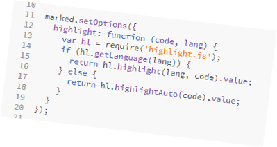

##How I built the present GitHub userpage static site

I needed a blog but I was unhappy with the services out there. I wanted *full* control over the 
how it looks (even though I am not a designer) and behaves. I also wanted to have my content on my computer.

###The idea

This is how i got to the idea of hosting a static user page at GitHub. Looking around for static 
site generators I found Jekyll and Octopress a framework based on Jekyll. But...

###The problem

I am a Windows user and installing, configuring and running ruby on a windows machine is no easy task. 
On the other hand I am not using ruby and taking the trouble to install it just for the sake of Jekyll 
it was not appealing. So, as a developer, I decided to build my own basic static web site generator.

This gave me the oportunity to use my tools of choice: [nodejs](http://nodejs.org/), 
[gulpjs](http://gulpjs.com/) and of course [git](http://git-scm.com/).

And this is how the jurney beggins. 

### In the same series
* [How I built the present GitHub userpage static site](how-i-built-the-present-github-userpage-static-site.html)
* [How I built it - the tools](how-i-built-it-the-tools.html)
