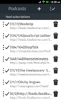
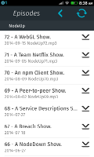

## Firefox OS - Podcast manager

I am a big fan of technology podcasts. I spend a lot of time in traffic listening and getting up to date with the lastest trends in technology.

There is an app in the store but I wanted to create my own in order to include the features I needed. 

Bellow You can see two screen shots of it.

I have used, as I was suposed to, HTML5 and Javascript [Backbone.js](http://backbonejs.org/) in the flavor of [Exoskeleton](http://exosjs.com/) as my framework of choice. This is a fairly complex app, since it deals with various APIs like network and storage. 

Exoskeleton sounded like a good idea at first, advertising that it has no jquery and underscore dependencies. But when writing an complex app you will soon find that you will need some of the utility functions that they offer. So I ended including the [lodash](http://lodash.com/) library for templating and some other functions.

For styling I have used the [building blocks]() graciously made available by mozilla.

