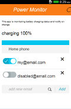

## Firefox OS - Power monitor

Sometimes I leave home for days. With one such ocasion the electricity safety fuse poped off and, of course, stayed. You can imagine what happened in the fridge :-). That is how I got the idea of an application to monitor such events. 

Basically, I wanted something to tell me when I have an power interruption. So I created this app for my Firefox OS phone. So I built a HTML5 app that hooks into Battyery API and send e-mail notifications when battery charging status change in a significant way.

The application have two main components. The client that monitors the status changes and the notification service that is written in Python and run on Google's app engine. When the power status in my howse changes, the app issue an XMLHttpRequest to the notification endpoint which then sends an e-mail notification to the listed and enabled e-mail addresses.

Now I can leave the home confident that I will know when the power gets interrupted and restored.

